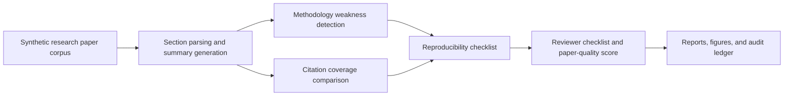

# AI-Powered Research Paper Reviewer Assistant

<p align="center"><strong>Independent research-grade reviewer-support assistant for summarizing synthetic research papers, detecting methodology weaknesses, comparing citation coverage, generating review checklists, and preserving transparent audit trails.</strong></p>

<p align="center">
  <a href="../../actions/workflows/python-checks.yml"></a>
  <a href="LICENSE"></a>
  
  
</p>

> **Peer-review boundary:** this repository uses fictional synthetic papers, claims, methods, citations, and reviewer signals by default. It is independent reviewer-support infrastructure only. It is not an automatic paper acceptance/rejection system, plagiarism judgment tool, academic misconduct detector, citation-law authority, or substitute for expert peer review.

---

## Research objective

Can an AI-powered research paper reviewer assistant summarize scholarly papers, detect weak methodology, compare citation coverage, and generate transparent review checklists without replacing human peer review?

| Research question | Evidence generated locally |
| --- | --- |
| What is each paper about? | Paper summary table and contribution extraction |
| Which papers show methodology risk? | Methodology weakness audit and risk scores |
| Are citations broad and relevant enough? | Citation coverage comparison and related-work gap flags |
| Are reproducibility details sufficient? | Reproducibility and artifact checklist |
| What should reviewers inspect? | Structured reviewer checklist and human-review recommendation |
| Can review assistance remain auditable? | Hash-chained audit ledger |

---

## Architecture

<p align="center"></p>



---

## Run today — no real manuscripts needed

```bash
python scripts/run_synthetic_review_lab.py
```

Windows quick start:

```bat
cd %USERPROFILE%\ai-powered-research-paper-reviewer-assistant
git pull

py -m venv .venv
.venv\Scripts\activate

python -m pip install --upgrade pip
python -m pip install -r requirements.txt
python scripts/run_synthetic_review_lab.py
```

Optional controls:

```bash
python scripts/run_synthetic_review_lab.py --papers 36 --seed 42
```

---

## Generated local outputs

```text
outputs/results/synthetic_papers.csv
outputs/results/synthetic_citation_library.csv
outputs/results/synthetic_paper_citations.csv
outputs/results/synthetic_paper_summaries.csv
outputs/results/synthetic_methodology_audit.csv
outputs/results/synthetic_citation_comparison.csv
outputs/results/synthetic_reproducibility_checklist.csv
outputs/results/synthetic_reviewer_checklist.csv
outputs/results/synthetic_paper_quality_scores.csv
outputs/results/synthetic_review_summary.json
outputs/reports/synthetic_research_review_report.md
outputs/audit/research_review_audit_log.jsonl

outputs/figures/synthetic_methodology_risk.png
outputs/figures/synthetic_citation_coverage.png
outputs/figures/synthetic_reproducibility_readiness.png
outputs/figures/synthetic_quality_scores.png
outputs/figures/synthetic_review_recommendations.png
```

---

## Reviewer-support modules

| Module | Purpose |
| --- | --- |
| Synthetic corpus generator | Builds fictional paper sections, claims, methods, citations, and evidence profiles |
| Summary assistant | Extracts compact summaries, contributions, research questions, and limitation statements |
| Methodology audit | Flags weak baseline use, vague datasets, unclear metrics, overclaiming, and limited ablation |
| Citation comparison | Compares citation breadth, recency, method diversity, and related-work coverage |
| Reproducibility checklist | Checks dataset, code, metrics, experiment detail, limitations, and artifact readiness |
| Reviewer checklist | Produces non-decisive human-review prompts and reviewer action items |
| Audit ledger | Records reproducible run summaries using a hash-chained JSONL log |

---

## Independent peer-review boundary

This project supports research-review assistance, triage, transparency, and reproducible critique. Real peer review requires human experts, field-specific judgment, conflict-of-interest handling, confidentiality controls, editorial policy, ethics review, and careful reading of the original paper.

The system should never be used as the sole basis for paper acceptance, rejection, plagiarism accusations, academic misconduct determinations, grant decisions, hiring decisions, or ranking researchers.

---

## Repository map

```text
src/paperreview/
  synthetic.py       # fictional papers, claims, methods, and citations
  summarizer.py      # summaries, contributions, questions, and limitations
  methodology.py     # methodology weakness and overclaiming audit
  citations.py       # citation coverage and related-work comparison
  checklist.py       # reproducibility and reviewer checklists
  scoring.py         # paper-quality score and review recommendation
  audit.py           # hash-chained audit ledger
  visualization.py   # local figures
  reporting.py       # Markdown reviewer-support report
scripts/
  run_synthetic_review_lab.py
docs/
  methodology.md
  peer_review_boundary.md
  synthetic_lab.md
  report_template.md
tests/
  test_synthetic.py
  test_review_modules.py
  test_pipeline.py
  test_audit.py
```

---

## Limitations

- Synthetic data validates the pipeline but does not prove performance on real papers.
- Rule-based checks are transparent baselines, not complete scholarly judgment.
- Citation comparison is a coverage signal, not a final authority on literature quality.
- Human expert review remains required for all real peer-review decisions.
