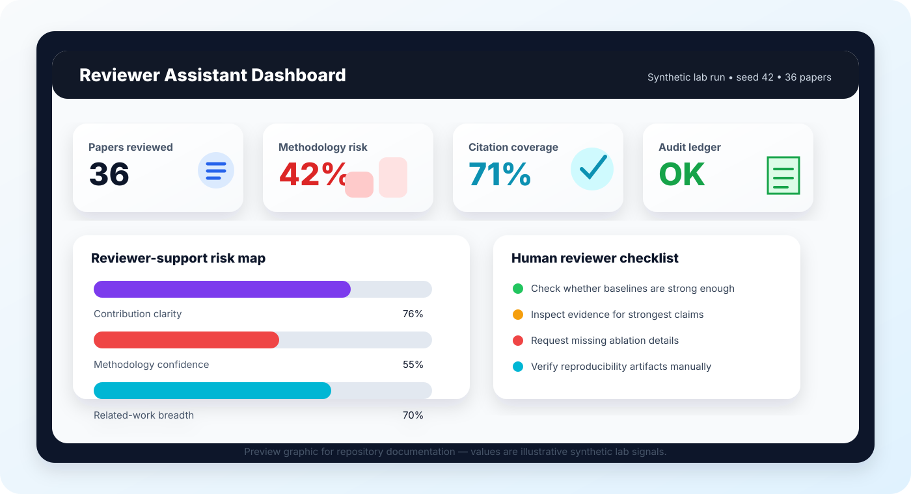
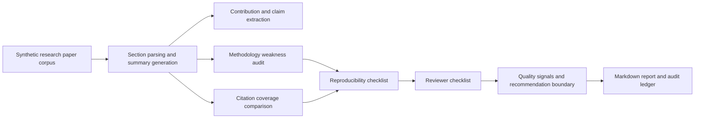
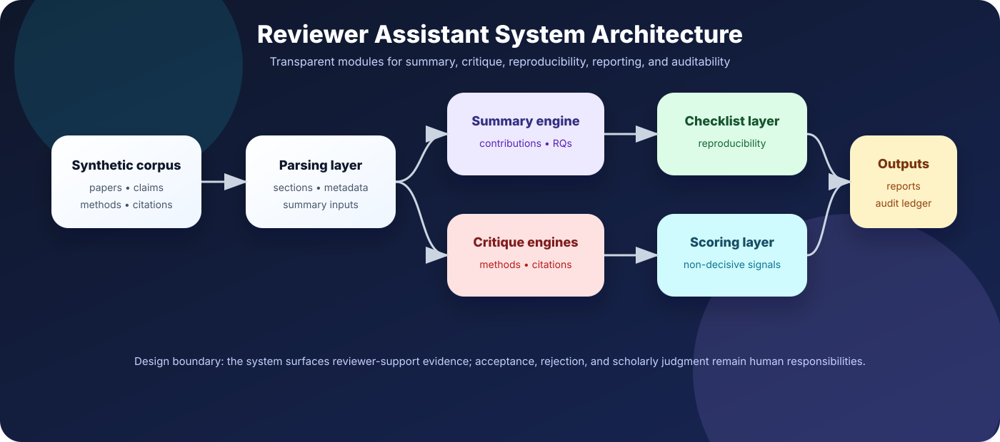

<p align="center">
  
</p>

<h1 align="center">AI-Powered Research Paper Reviewer Assistant</h1>

<p align="center">
  <b>A research-grade reviewer-support laboratory for summarizing papers, auditing methodology, checking citation coverage, generating reproducibility checklists, and preserving transparent review trails.</b>
</p>

<p align="center">
  <a href="../../actions/workflows/python-checks.yml"></a>
  
  
  
  
  
</p>

---

## Overview

**AI-Powered Research Paper Reviewer Assistant** is an independent academic research prototype for studying how AI systems can support scholarly peer review without replacing human reviewers. The repository focuses on transparent, auditable reviewer-support workflows: paper summarization, contribution extraction, methodology weakness detection, citation coverage comparison, reproducibility checking, review-question generation, and hash-chained audit logging.

The project is designed for PhD-level experimentation in **AI-assisted research evaluation, scholarly communication, human-AI collaboration, research integrity, and explainable reviewer-support systems**.

> **Peer-review boundary:** This repository uses fictional synthetic papers, claims, methods, citations, and reviewer signals by default. It is not an automatic paper acceptance or rejection system, plagiarism judgment tool, academic misconduct detector, citation-law authority, grant-ranking engine, or substitute for expert peer review.

<p align="center">
  
</p>

---

## Research objective

The central research question is:

**Can an AI-powered reviewer assistant produce useful, transparent, and reproducible review-support signals while keeping final scholarly judgment in the hands of human experts?**

| Research question | Evidence generated locally |
|---|---|
| What is each paper about? | Structured paper summaries, contributions, claims, and limitations |
| Are methods and experiments sufficiently described? | Methodology weakness audit and risk score |
| Is the related work broad and relevant enough? | Citation coverage and related-work gap signals |
| Are the results reproducible? | Dataset, code, metrics, ablation, and artifact checklist |
| What should a reviewer inspect carefully? | Human-review checklist and non-decisive action prompts |
| Can every run be audited later? | Hash-chained JSONL audit ledger |

---

## Visual research workflow

<p align="center">
  
</p>



---

## System architecture

<p align="center">
  
</p>

The system is intentionally modular so each reviewer-support signal can be inspected, tested, replaced, or extended.

| Layer | Purpose |
|---|---|
| Synthetic corpus generator | Creates fictional papers, sections, claims, methods, results, citations, and quality profiles |
| Summary assistant | Extracts paper-level summaries, research questions, contributions, findings, and limitations |
| Methodology audit | Flags weak baselines, vague datasets, unclear metrics, missing ablation, and overclaiming |
| Citation comparison | Evaluates breadth, recency, method diversity, and related-work coverage |
| Reproducibility checklist | Checks artifact, code, data, metrics, experiment detail, and limitation reporting |
| Reviewer checklist | Produces non-decisive prompts for expert human reviewers |
| Audit ledger | Records run metadata and review-support outputs with hash chaining |
| Reporting layer | Exports CSV files, Markdown reports, and local figures |

---

## Run today — no real manuscripts needed

```bash
python -m venv .venv
source .venv/bin/activate  # Windows: .venv\Scripts\activate
python -m pip install --upgrade pip
python -m pip install -r requirements.txt
python scripts/run_synthetic_review_lab.py
```

Optional controls:

```bash
python scripts/run_synthetic_review_lab.py --papers 36 --seed 42
```

Run tests:

```bash
python -m pytest -q tests
```

---

## Generated outputs

```text
outputs/results/synthetic_papers.csv
outputs/results/synthetic_citation_library.csv
outputs/results/synthetic_paper_citations.csv
outputs/results/synthetic_paper_summaries.csv
outputs/results/synthetic_methodology_audit.csv
outputs/results/synthetic_citation_comparison.csv
outputs/results/synthetic_reproducibility_checklist.csv
outputs/results/synthetic_reviewer_checklist.csv
outputs/results/synthetic_paper_quality_scores.csv
outputs/results/synthetic_review_summary.json
outputs/reports/synthetic_research_review_report.md
outputs/audit/research_review_audit_log.jsonl
outputs/figures/synthetic_methodology_risk.png
outputs/figures/synthetic_citation_coverage.png
outputs/figures/synthetic_reproducibility_readiness.png
outputs/figures/synthetic_quality_scores.png
outputs/figures/synthetic_review_recommendations.png
```

---

## Example reviewer-support signals

| Signal | Interpretation | Human reviewer action |
|---|---|---|
| High methodology risk | Possible weak baselines, unclear metrics, or missing ablation | Inspect methods and experiments manually |
| Low citation coverage | Related work may be narrow, outdated, or method-limited | Check whether important literature is missing |
| Low reproducibility readiness | Code, data, metrics, seeds, or evaluation details may be incomplete | Request clarifications or artifacts if appropriate |
| Overclaiming flag | Claims may exceed available evidence | Compare claims against actual experiments |
| Audit-ledger entry | Run can be traced and inspected later | Preserve reviewer-support provenance |

---

## Repository map

```text
ai-powered-research-paper-reviewer-assistant/
├── README.md
├── LICENSE
├── CITATION.cff
├── CONTRIBUTING.md
├── SECURITY.md
├── requirements.txt
├── assets/
│   ├── banner.svg
│   ├── reviewer-dashboard.svg
│   ├── review-workflow.svg
│   └── reviewer_assistant_architecture.svg
├── src/paperreview/
│   ├── synthetic.py
│   ├── summarizer.py
│   ├── methodology.py
│   ├── citations.py
│   ├── checklist.py
│   ├── scoring.py
│   ├── audit.py
│   ├── visualization.py
│   └── reporting.py
├── scripts/
│   └── run_synthetic_review_lab.py
├── docs/
│   ├── reviewer-protocol.md
│   ├── governance-and-boundaries.md
│   ├── reproducibility-playbook.md
│   └── publication-readiness-plan.md
├── tests/
└── .github/workflows/python-checks.yml
```

---

## Academic use cases

### For PhD students

- Study AI-assisted peer-review workflows.
- Build transparent reviewer-support baselines.
- Compare methodology and reproducibility signals across synthetic papers.
- Prototype literature-review and manuscript-quality analysis modules.

### For supervisors and labs

- Teach research integrity and review boundaries.
- Demonstrate reproducible review-support pipelines.
- Compare how different rule sets change review recommendations.
- Discuss explainability, auditability, and human oversight.

### For software engineering and AI research

- Explore human-AI collaboration in scholarly review.
- Design reviewer-assistance tools with explicit safety boundaries.
- Evaluate structured critique generation without claiming automatic decision authority.

---

## Research design principles

1. **Human-in-the-loop by design** — the system generates review-support signals, not final decisions.
2. **Synthetic data by default** — no confidential manuscripts are required to run the lab.
3. **Transparent baseline first** — rule-based checks are inspectable before advanced AI is added.
4. **Auditability** — outputs should be traceable to inputs and run metadata.
5. **Academic integrity** — review assistance must not fabricate citations, invent evidence, or replace expert judgment.

---

## Roadmap

### Phase 1 — Research prototype

- [x] Synthetic paper corpus
- [x] Reviewer-support pipeline
- [x] Methodology audit
- [x] Citation coverage comparison
- [x] Reproducibility checklist
- [x] Markdown report generation
- [x] Audit ledger
- [x] CI checks

### Phase 2 — Stronger research signals

- [ ] Add section-level claim-evidence mapping
- [ ] Add reviewer disagreement simulation
- [ ] Add rubric sensitivity analysis
- [ ] Add confidence calibration for reviewer-support signals
- [ ] Add citation-network visualization

### Phase 3 — Human-AI evaluation

- [ ] Design reviewer user-study protocol
- [ ] Compare AI-assisted vs unaided review workflows
- [ ] Measure cognitive load and reviewer trust
- [ ] Add qualitative coding template for reviewer feedback

### Phase 4 — Publication-ready package

- [ ] Add benchmark paper sets with clear permissions
- [ ] Add ablation study scripts
- [ ] Add manuscript-ready figures
- [ ] Add pre-registration template
- [ ] Add external validation plan

---

## Ethics and responsible-use statement

This project is reviewer-support infrastructure only. It should never be used as the sole basis for acceptance, rejection, plagiarism accusations, misconduct determinations, grant decisions, hiring decisions, tenure review, institutional ranking, or researcher scoring. Real peer review requires domain expertise, confidentiality controls, conflict-of-interest handling, editorial policies, and careful reading of the original manuscript.

For more detail, see [`docs/governance-and-boundaries.md`](docs/governance-and-boundaries.md).

---

## Citation-style statement

> AI-Powered Research Paper Reviewer Assistant is an independent research prototype for auditable AI-assisted peer-review support. It uses synthetic manuscripts by default and provides transparent modules for paper summarization, methodology auditing, citation coverage comparison, reproducibility checking, reviewer checklist generation, reporting, and hash-chained audit logging.

---

## License

This project is released under the MIT License.

<p align="center">
  <b>AI should support peer review with evidence, transparency, and human judgment — not replace it.</b>
</p>
